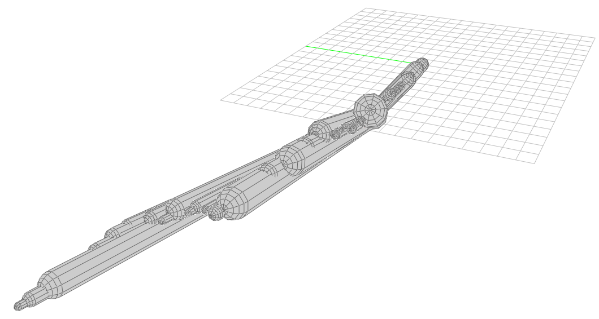
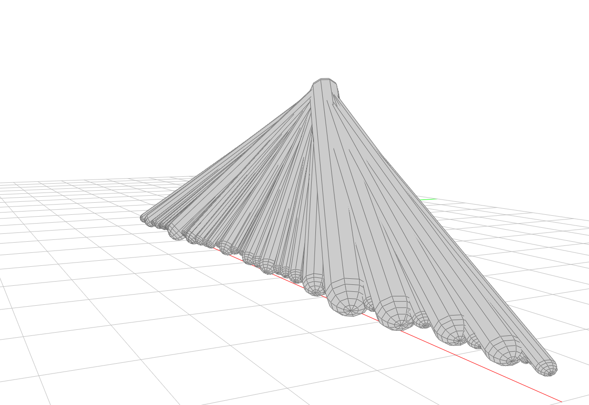

# Virtual_Sculpture

Using COMPAS Data Structure Mesh with a python script to generate a virtual sculpture in Computational Geometry. 

▌ Hyperbolic Polyhedron

Locate the points of mesh distributed in space with hyperbolic parabolic surface, then generate polyhedron with random radius, vertices & faces according to point coordinates, to obtain hyperbolic parabolic surface asteroid belt with single solid mesh, non-manifold edges and self-intersecting. The polyhedrons were subdivided into a mesh with the Catmull–Clark algorithm. The Catmull–Clark scheme is a technique used in 3D computer graphics to create curved surfaces by using subdivision surface modeling.

This code imports several libraries such as math, random, compas, and compas.geometry, as well as specific functions from compas.geometry, compas_cgal.subdivision, and compas_view2.app. It also imports a mesh from a file named 'hypar.obj' using the compas.datastructures.Mesh.from_obj() method.

The code creates a 3D viewer using the compas_view2.app.App() method. It then loops through all faces in the imported mesh and calculates the centroid and frame of each face. Within the loop, the code also generates a random float value between 0.2 and 0.6, which is used to create a box with dimensions r x r x r centered on the face's centroid and oriented with the face's frame.

The code then applies the Catmull-Clark subdivision algorithm from the compas_cgal.subdivision library to the generated box, which refines the mesh and returns new vertices and faces. The Polyhedron class from compas.geometry is used to create a polyhedron object from the new vertices and faces. The polyhedron is then translated by a vector of [4,0,0] using the Translation.from_vector() method from compas.geometry, and added to the viewer using the viewer.add() method.

Finally, the viewer.run() method is called, which opens the 3D viewer and displays the generated polyhedra. Therefore, the code generates a set of polyhedra by subdividing randomly generated boxes and displays them in a 3D viewer.

> 1.Imports the math and random modules for mathematical operations and generating random numbers, respectively.
>
>2.Imports the compas library, which is a computational framework for architecture and engineering.
>
>3.Defines a 3D mesh object named mesh by reading an OBJ file called hypar.obj from the compas data directory using the cd.Mesh.from_obj() method.
>
>4.Initializes a 3D viewer object using the compas_view2.app module.
>
>5.Iterates through each face of the mesh, calculates the centroid and plane of each face, and generates 64 random radiuses of varying sizes using the cg.Box() method.
>
>6.Applies the Catmull-Clark subdivision algorithm to each box, creating a new mesh with more vertices and faces than the original mesh.
>
>7.Translates the resulting mesh by a fixed amount in the x-direction using the Translation.from_vector() method.
>
>8.Adds the resulting mesh to the viewer using the viewer.add() method.
>
>9.Displays the resulting mesh in the viewer using the viewer.run() method.

   

  * hyperbolic parabolic surface consist of polyhedrons with vertices & faces ( 2 subdivision steps)
  
   

  * hyperbolic parabolic surface consist of polyhedrons with vertices & faces ( 6 subdivision steps)
  
▌Random Walk Capsule

This part generates a 3D model of a random walk using the COMPAS library. A random walk is a mathematical model that describes a path that consists of a series of random steps. In this case, the random steps are simulated using a stochastic process that generates random vectors in 3D space. The resulting path is represented as a sequence of capsules, which are 3D shapes that consist of a cylinder and two hemispheres on each end.

The rw() function is the core of the random walk simulation. It takes as input the current position in 3D space (current_coor) and the radius of the previous capsule (previous_radius). It returns a new capsule, the new position in 3D space, and the new radius.

The random walk simulation in this code is affected by two sources of randomness: the direction of each step and the step size. The direction is randomly chosen from a set of four possible vectors, each with a different probability. The step size is randomly chosen from a normal distribution, with a mean that depends on the current height in 3D space and a fixed standard deviation. The radius of each capsule is determined by the difference in step size between the current step and previous radius.

The main loop generates 100 capsules by repeatedly calling the rw() function with the previous capsule's end point and radius. The resulting capsules are stored in a list called geometries. If the code is run outside of the Grasshopper environment, the capsules are displayed in a 3D viewer provided by the COMPAS library. If the code is run inside the Grasshopper environment, the capsules are returned as a Grasshopper data structure.

   
   

  * A sequence of capsules with random steps walking with different 'steer_prob' and 'acceleration' setting.
 
