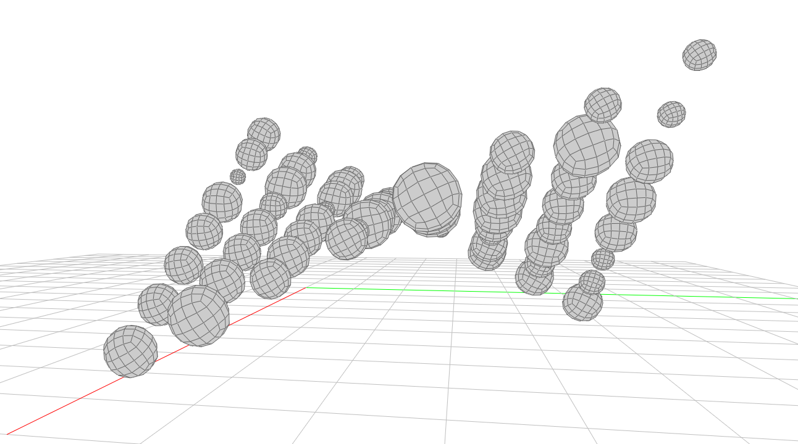
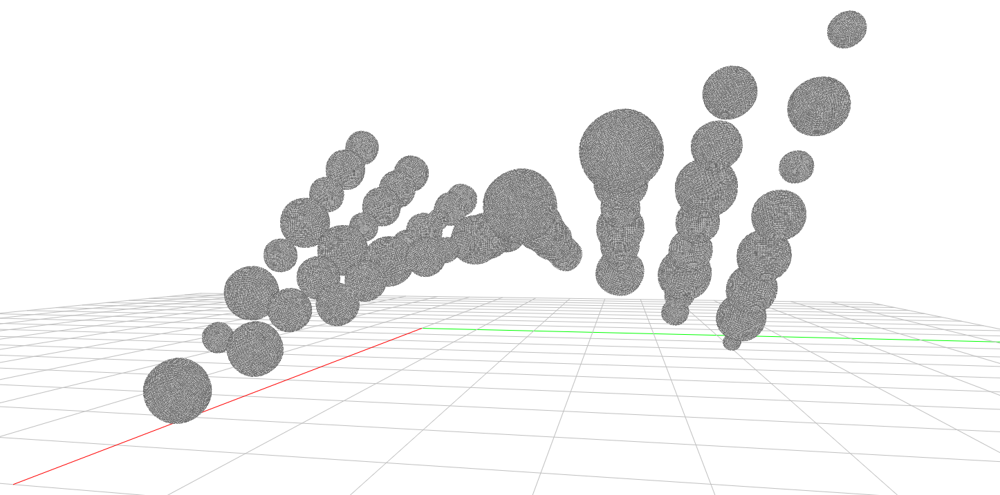

# Virtual-Sculpture-Mesh
Using COMPAS Data structure Mesh with a python script to generate a virtual sculpture in Computational Geometry. 
Locate the points distributed in space with hyperbolic parabolic surface, then generate polyhedron with random radius, vertices & faces according to point coordinates, to obtain hyperbolic parabolic surface asteroid belt with single solid mesh, non-manifold edges and self-intersecting.

   

  * hyperbolic parabolic surface consist of polyhedrons with vertices & faces ( 2 subdivision steps)
  
   

  * hyperbolic parabolic surface consist of polyhedrons with vertices & faces ( 6 subdivision steps)
